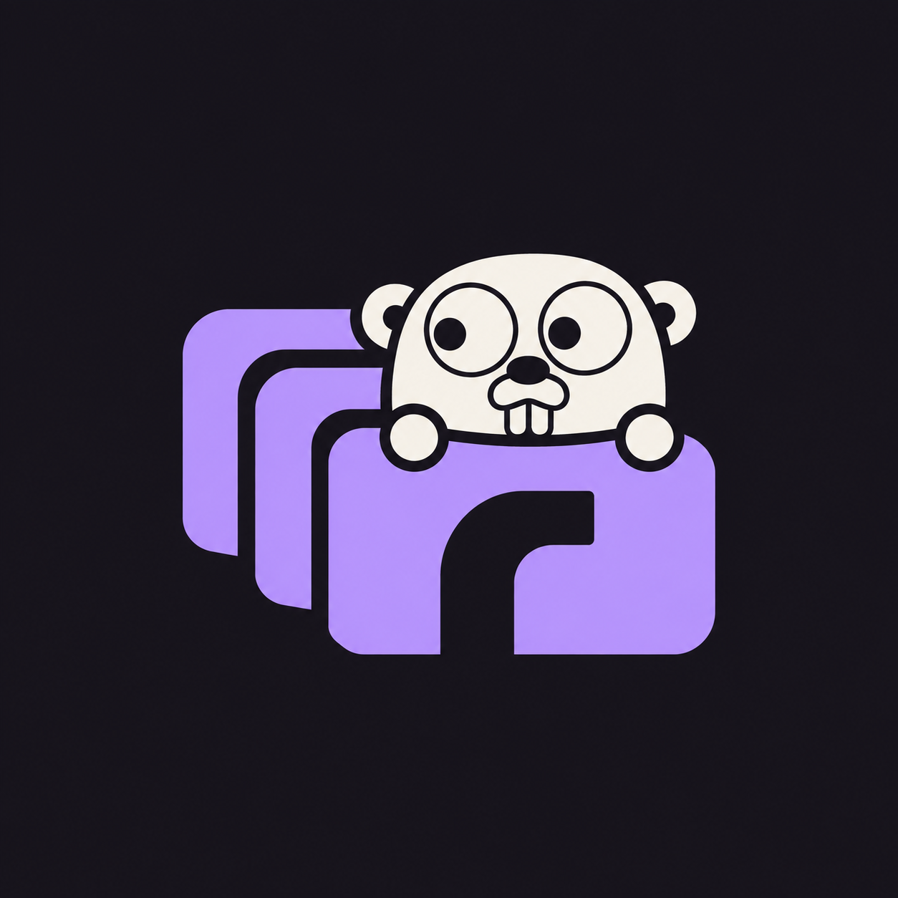
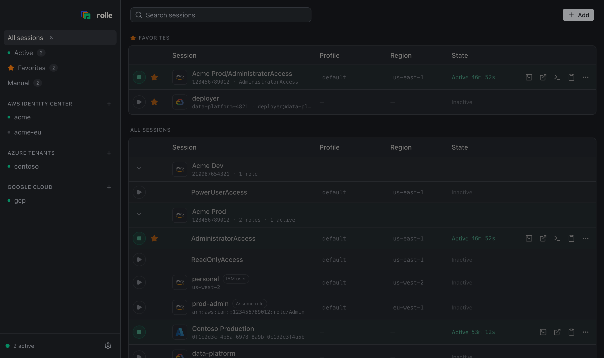

<p align="center">
  
</p>

# rolle

Assume any role, any cloud.

<p align="center">
  
</p>

rolle is a desktop app and CLI that hands short-lived cloud credentials to your
tools without writing a secret to disk. It covers AWS, Azure, and Google Cloud.

## What it does

- **AWS**: sign in to IAM Identity Center once and get every account and role you
  can reach. Chain `AssumeRole` from any session. Add IAM users with optional MFA.
  Each active session is an AWS profile backed by `credential_process`, so every
  SDK and the AWS CLI pick it up with `--profile`.
- **Azure**: sign in to an Entra ID tenant with your Microsoft account. Every
  subscription becomes a session that yields Azure Resource Manager tokens.
- **Google Cloud**: reuse the credentials `gcloud` already has. Every project
  becomes a session, and you can impersonate service accounts.
- **Desktop app**: dark or light theme, guided onboarding, a dashboard with live
  expiry countdowns, favorites, one-click console and terminal actions, and
  signed self-updates.
- **Secrets** live in the OS keychain. rolle caches short-lived credentials
  with owner-only permissions, and they expire on their own.
- **No telemetry.** The app and the CLI send nothing about you or your usage
  anywhere. They talk only to the cloud providers you sign in to and to GitHub
  releases for the update check, which you can turn off.

rolle imports what your machine already has: Identity Center portals from the
AWS CLI and Granted, Azure tenants from the az CLI, gcloud credentials, and
sessions from a [Leapp](https://github.com/Noovolari/leapp) workspace.

## Install

```sh
brew install --cask nateships/tap/rolle
```

The cask installs the desktop app and the `rolle` command.

Windows and Linux desktop builds, and CLI archives for every platform, are on
the [releases page](https://github.com/nateships/rolle/releases). Docs live at
[getrolle.com](https://getrolle.com).

## CLI

```sh
rolle integration add aws-sso --alias acme --start-url https://acme.awsapps.com/start --region us-east-1
rolle integration login acme          # opens the browser, discovers roles
rolle start "Acme Prod/AdministratorAccess"
aws sts get-caller-identity --profile default
eval "$(rolle env "Acme Prod/AdministratorAccess")"   # or export into the shell
```

Every AWS session writes the profile `default` unless you name one. Azure,
Google Cloud, role chaining, IAM users, and every flag are in the
[CLI reference](https://getrolle.com/cli). [getrolle.com/roadmap](https://getrolle.com/roadmap)
lists what works and what does not.

## Support

Bugs and questions go to [GitHub issues](https://github.com/nateships/rolle/issues/new/choose). In the app, **Settings → About → Report a problem** opens the form with your version and platform filled in, and **Support bundle** writes a redacted zip to attach.

## Contributing

```sh
mise install
mise run setup          # frontend deps + git hooks
mise run check          # go vet, lint, tests
mise run check:frontend # typecheck, lint, format, tests
mise run hooks          # every pre-commit hook on the whole tree
mise run desktop        # run the desktop app in dev mode
mise run desktop:demo   # same, on fictional data; nothing real is touched
mise run cli -- <args>  # run the CLI from source, for example: mise run cli -- integration list
mise run docs           # serve the docs site
```

Tools come from mise. Frontend and docs packages use [aube](https://aube.sh).
Set `ROLLE_DEBUG=1` (or pass `rolle --debug`) for verbose diagnostics.
`mise run reset` wipes the local workspace, secrets, cache, and AWS profiles.

Layout:

- `internal/core`: domain model (integrations, sessions, credentials, workspace)
- `internal/app`: application layer shared by the CLI and desktop app
- `internal/aws`, `internal/azure`, `internal/gcp`: cloud providers
- `internal/discover`: import sources (AWS CLI, Granted, az CLI, gcloud, Leapp)
- `internal/awsconfig`, `internal/credcache`, `internal/secrets`, `internal/workspace`: storage
- `internal/terminal`: opens a terminal with a session's environment
- `cmd/rolle`: CLI
- `apps/desktop`: Wails v3 desktop app (React, Tailwind v4, shadcn/ui)
- `docs`: docs site for getrolle.com (Blume, built by Vercel with aube); `docs/brand` holds the brand kit

Read [docs/brand/README.md](docs/brand/README.md) before you change logos, app
icons, typography, or brand colors.

## License

[GPL-3.0-or-later](LICENSE). Forks and redistributions must stay open under the same terms.
The Go gopher artwork is by [Renee French](https://go.dev/blog/gopher),
adapted for rolle under [CC BY 4.0](https://creativecommons.org/licenses/by/4.0/).
