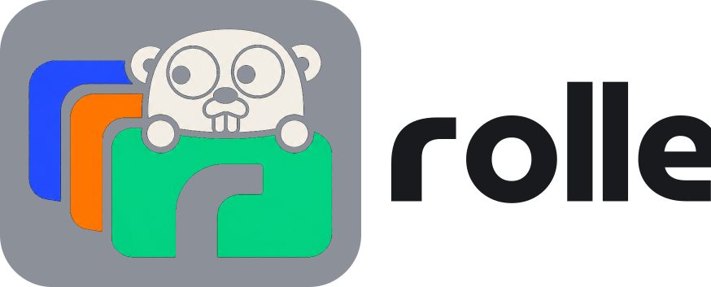

<p align="center">
  <picture>
    <source media="(prefers-color-scheme: dark)" srcset="docs/public/logo-dark.svg">
    
  </picture>
</p>

<p align="center">
  <a href="https://github.com/nateships/rolle/actions/workflows/ci.yml"></a>
  <a href="https://github.com/nateships/rolle/releases/latest"></a>
  <a href="https://scorecard.dev/viewer/?uri=github.com/nateships/rolle"></a>
  <a href="https://www.bestpractices.dev/projects/14603"></a>
  <a href="https://docs.renovatebot.com/"></a>
  <a href="LICENSE"></a>
</p>

# rolle

Assume any role, any cloud.

<p align="center">
  
</p>

rolle is a desktop app and a CLI. It hands short-lived AWS, Azure, and Google Cloud credentials to your tools and writes no secret to disk.

- **AWS.** Sign in to IAM Identity Center once and get every account and role you can reach. Chain `AssumeRole` from any session. Add IAM users, with MFA when you want it. Each active session is a profile backed by `credential_process`, so the AWS CLI and every SDK use it with `--profile`.
- **Azure.** Sign in to an Entra ID tenant. Each subscription is a session that yields Resource Manager tokens.
- **Google Cloud.** Reuse the credentials `gcloud` has. Each project is a session. Impersonate service accounts.
- **Desktop app.** Live expiry countdowns, favorites, tags, one-click console and terminal, a tray with quick actions, and signed self-updates.
- **Secrets** live in the OS keychain. Short-lived credentials sit in owner-only files and expire on their own.
- **No telemetry.** rolle talks to the clouds you sign in to and to GitHub releases for the update check, which you can turn off. Nothing else.

rolle imports what your machine has: Identity Center portals from the AWS CLI and Granted, tenants from the az CLI, gcloud credentials, and a [Leapp](https://github.com/Noovolari/leapp) workspace.

## Install

```sh
brew install --cask nateships/tap/rolle
```

The cask installs the app and the `rolle` command. Windows and Linux builds and CLI archives are on the [releases page](https://github.com/nateships/rolle/releases). Docs: [getrolle.com](https://getrolle.com).

## CLI

```sh
rolle integration add aws-sso --alias acme --start-url https://acme.awsapps.com/start --region us-east-1
rolle integration login acme
rolle start "Acme Prod/AdministratorAccess"
aws sts get-caller-identity --profile default
```

`--json` and stable exit codes make it scriptable. See the [CLI reference](https://getrolle.com/cli) and [Agents and scripts](https://getrolle.com/agents).

## Support

Open an [issue](https://github.com/nateships/rolle/issues/new/choose). In the app, **Settings → About → Report a problem** fills in your version and platform, and **Support bundle** writes a redacted zip to attach.

## Contributing

[CONTRIBUTING.md](CONTRIBUTING.md): setup, tasks, the commit convention, releases, and the repository layout.

## License

[GPL-3.0-or-later](LICENSE). The Go gopher artwork is by [Renee French](https://go.dev/blog/gopher), adapted for rolle under [CC BY 4.0](https://creativecommons.org/licenses/by/4.0/).
