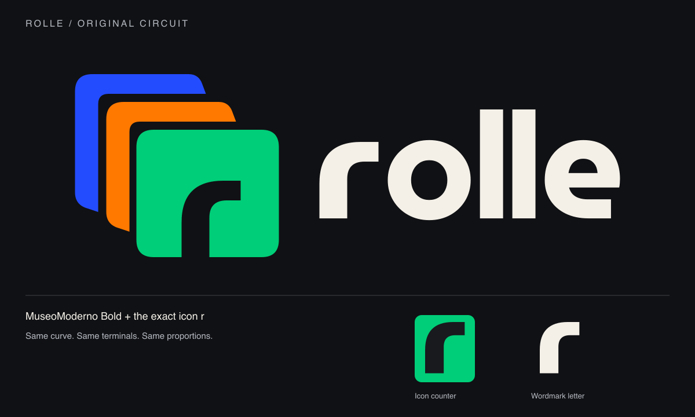

# Rolle typography: match the icon r

The custom wordmark uses the exact icon r, followed by **MuseoModerno Bold (700)** o, l, l, and e outlines. The bundled MuseoModerno font is unmodified; use the SVG master for the custom logo.



## Use the outlined master for the logo

- wordmark/wordmark-ivory.svg: standalone wordmark for dark surfaces.
- wordmark/wordmark-charcoal.svg: standalone wordmark for light surfaces.
- wordmark/wordmark-blue.svg: optional cobalt wordmark; prefer ivory on dark surfaces.
- wordmark/lockup-dark.svg: stack plus ivory wordmark, transparent canvas.
- wordmark/lockup-light.svg: three-color stack plus charcoal wordmark, transparent canvas.
- wordmark/icon-r.svg: exact positive shape of the icon's negative-space r.

These SVGs contain paths and need no runtime font. Use the supplied master rather than retyping the logo, as the font's stock r is similar but not identical. The logo has explicit optical spacing built into the paths; CSS tracking does not apply to the SVG.

The r path is the icon counter translated by (-264, -282), with the same curve, terminal shapes and aspect ratio. It is scaled uniformly when placed in the wordmark. The remaining glyphs come from MuseoModerno at weight 700. They retain their natural proportions; the builder sets 16 units of visible gap between letters with an r height of 132 units.

## Font for typeset brand text

Use MuseoModerno, weight 700, normal upright style. The CSS wordmark/display fallback uses -0.025em letter spacing. This fallback does not reproduce the custom logo exactly. Body/interface sans and command monospace remain separate tokens.

The unmodified variable TTF and its OFL license are bundled in fonts/. fonts/fonts.css demonstrates local loading. When deploying, copy the font and license to the app's verified asset location and adjust the CSS URL as needed.

## Regenerate the SVGs

Install the dependency in wordmark/requirements.txt in a Python environment, then run from docs/brand:

```sh
python wordmark/build_wordmark.py fonts/MuseoModerno-Variable.ttf icons/mark.svg wordmark
```

The builder checks the source icon's r geometry and stops if it has changed. Its SVG preview is editable; the PNG preview is a rendered copy.

## Sources and license

MuseoModerno is by Omnibus-Type. The upstream font and SIL Open Font License 1.1 are included together. Sources:

- https://github.com/Omnibus-Type/MuseoModerno
- https://github.com/google/fonts/tree/main/ofl/museomoderno
- https://fonts.google.com/specimen/MuseoModerno

The font license is separate from the Go gopher attribution. Preserve fonts/OFL-MuseoModerno.txt when redistributing the bundled font.
